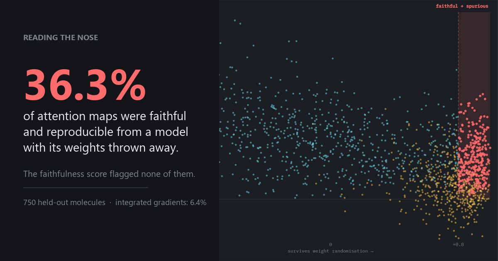

# Reading the Nose

**An explanation that passes a faithfulness test can still be meaningless.**

Across 750 held-out molecules, 36.3% of this model's attention maps both predicted
its own behaviour under masking *and* reproduced almost exactly on a copy of the
model with every weight thrown away. The faithfulness score flagged none of them.

[Full results](data_audit/)



---

## What this project actually is

Two experiments, run in that order, reported in that order.

**First**, the novel and harder one: predict how a cheap metal-oxide gas sensor
array responds to a molecule, from the molecule's graph, and use the model's
attention to explain why the sensor confuses chemically unrelated compounds. It
failed. Under leave-molecule-out cross-validation across all 13 molecules that
public data exists for, **no model beat a constant prediction**.

**Second**, added to diagnose the first: run the identical pipeline on odour
descriptor prediction over 4,975 molecules, to find out whether the negative meant
the method was wrong or the data was too thin. **It was the data.** With 383x the
molecules, graph models separate from the baselines cleanly.

The odour task is not novel. OpenPOM's own paper does it, and their ensemble is
stronger than anything here. It is in this repo as an instrument for diagnosing
the first result, and the contribution is the validation discipline applied to
both.

## Results

### Odour descriptor prediction, 4,975 molecules, scaffold-disjoint split

| model | macro AUROC | macro AP |
|---|---|---|
| constant | 0.5000 | 0.0353 |
| ECFP + MLP | 0.6483 | 0.0967 |
| GCN | 0.7486 | 0.1439 |
| GAT | 0.7533 | 0.1450 |
| GAT + sensor transfer | 0.7538 | 0.1476 |

3 folds x 3 seeds. Paired bootstrap over fold-seed pairs:

- **graph structure over fingerprint: +0.100 AUROC** (GCN), 95% CI
  [+0.088, +0.114], winning 9/9
- **attention over graph structure: +0.0046**, 95% CI [+0.0007, +0.0085],
  winning 7/9 &mdash; and it does not clear zero on macro AP, or on either metric
  under a random split
- sensor-task transfer: +0.0006, CI [-0.0062, +0.0083]

On one scale: fingerprint over constant +0.148, graph structure over fingerprint
+0.100, attention over graph structure +0.005. Attention buys about 4.5% of what
graph structure buys, on one of four measures.

> **Not a competitive result.** The claim is the internal comparison under
> identical conditions &mdash; which architectural ingredient carries the signal
> &mdash; not a better odour predictor.

### Explanation validation, 750 held-out molecule-seed observations

| | attention | integrated gradients |
|---|---|---|
| mean &rho; vs an untrained model | **+0.793** | +0.033 |
| fails randomisation check (&rho; > 0.8) | **60.4%** | 6.4% |
| passes faithfulness (deletion vs random) | 54.9% | 98.0% |
| **faithful AND spurious** | **36.3%** | 6.4% |

Attention maps here are not flat or degenerate. They are varied, confident, and
chemically plausible-looking. On four showcase molecules the trained and untrained
attention maps correlate at &rho; +0.95 to +0.97. That is what makes them
dangerous: nothing about the map itself, and nothing in the faithfulness number,
distinguishes them from a real explanation.

**If you validate explanations with a faithfulness metric alone, you ship spurious
maps at roughly 1 in 3 for attention and 1 in 16 for integrated gradients, and the
metric will not tell you which.**

### The sensor task (case study, section 05 of the report)

13 molecules, three sensor platforms, every public MOX array dataset with
identified single-molecule analytes. Median molecule size: 3 heavy atoms.

Under leave-molecule-out, no model beat a constant on the raw target. With the
shared common-mode component removed &mdash; which is driven substantially by
concentration, 51.5% of between-molecule variance on the wind-tunnel set &mdash;
a small real signal appears: ECFP+MLP +0.233 cosine, CI [+0.089, +0.388]; GCN
+0.172, CI [+0.012, +0.344]; GAT +0.068 and pretrained GAT +0.091, neither
clearing zero.

What survived is the sensor's confusion geometry. **Ammonia and toluene produce
near-identical array signatures (cosine +0.653 after centring) despite a Tanimoto
similarity of 0.00.** That pair comes from the one dataset with 30&ndash;47
concentration levels per gas, so it carries no concentration confound. The other
four quotable pairs do, and are labelled as such.

## A retracted finding

An earlier version of this work reported, as its headline, that the learned
attention was *uniform to floating-point precision*. That was wrong.

`attention_scores` aggregated attention by destination node. GATv2 applies softmax
over the edges arriving at each node, so that sum is exactly 1.0 for every node in
every graph in every model, trained or not. It measured the softmax normalisation
constant. The reported "spread" of 2e-08 was float32 rounding in a quantity that is
1.0 by construction.

Raw per-edge attention varies from 0.13 to 0.70. It was never uniform.

Full account in [`RETRACTION_attention_uniform.md`](data_audit/RETRACTION_attention_uniform.md),
including what it invalidated, what survived, and the two process failures: a
quantity constant to seven decimals across every molecule and seed is an identity
rather than a measurement, and the finding was convenient enough that it should
have attracted more suspicion, not less.

Two regression tests now pin both behaviours, and `attention_scores` takes an
explicit `reduce` argument with the broken option retained only for reproducing
the retracted numbers.

## Repository

```
src/rtn/            featurizer, model, targets, splits, evaluation, explainability
scripts/            one runnable script per phase, plus data extraction
data_audit/         every result document, including the retraction
tests/              15 tests, including regression guards for three real bugs
webapp/             the interactive report (template.html is the source)
docs/covers/        cover images, regenerated by scripts/make_covers.py
```

Reproduce in order:

```bash
python scripts/run_pretrain.py            # encoder on OpenPOM
python scripts/run_odor_phase2.py         # the baseline table
python scripts/run_odor_phase4.py         # explanation validation
python scripts/verify_attention_raw.py    # independent attention check
python scripts/export_galaxy_data.py      # viz data: sensor layer
python scripts/export_odor_layer.py       # viz data: odour layer
python scripts/build_webapp.py            # inline both into index.html
python scripts/make_covers.py             # cover images (needs playwright)
```

Sensor-side data is large: UCI 251 is 8.4 GB compressed and 107 GB uncompressed,
streamed by `scripts/extract_uci251.py` into a ~19k-row feature table. The UCI 270
loader is hand-written because `ucimlrepo` mis-parses that dataset, shifting every
column by one and discarding both the gas label and the concentration.

## Bugs found and documented

Three, all of which fail silently rather than loudly, and all now covered by tests:

1. **Attention aggregated over the softmax's own normalising axis**, producing a
   constant that was reported as a finding. Caught by an independent verification.
2. **The randomisation control was a dead model, not a random one.** The
   reinitialiser zeroed every 1-D parameter, which includes LayerNorm weights, so
   every LayerNorm emitted zero. Integrated gradients returned all-zero
   attributions and every sanity correlation came back NaN &mdash; a mandatory
   check that was silently vacuous.
3. **A transfer arm leaked its evaluation set.** The sensor-task encoder was
   warm-started from OpenPOM weights, then evaluated on OpenPOM. Caught by an
   implausible smoke-test score (0.747 against 0.645 for everything else).

## Honest limitations

- One architecture, untuned, carried unchanged across both tasks so the two tables
  stay comparable. A tuned GAT might separate from a GCN; not tested.
- The attention result is **"no meaningful effect detected", not "proven absent"**.
  Three folds cannot resolve a +0.005 effect.
- Scaffold folds are unbalanced because one Bemis-Murcko group dominates the
  corpus. Fold sizes range 1,373&ndash;2,230 test molecules.
- Why attention contributes so little is **not known**. No ablation on head count,
  batch size, or loss was run.
- The sensor half is bounded by 13 molecules with a median of 3 heavy atoms, and in
  the largest dataset analyte identity is fully confounded with concentration.

## Sources

Odour: OpenPOM GS-LF (GoodScents + Leffingwell), 4,983 molecules, 138 descriptors;
4,975 after removing the sensor analytes to prevent leakage.
Sensors: UCI 270 (Vergara 2012), UCI 251 (Vergara 2013), UCI 361 (Fonollosa 2016),
Zenodo 15681119, all CC BY 4.0.
Sanity check after Adebayo et al., *Sanity Checks for Saliency Maps*.
Sensing chemistry per Degler, Wagner & Weimar, *Sens. Actuators B* 2022, and
Hahn et al., *Sens. Actuators B* 2001.
